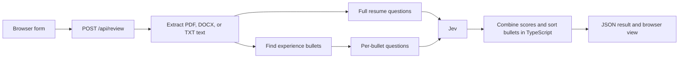

# How the resume review works

## What Jev does here

[Jev](https://docs.typesafe.ai/) is a TypeSafe System One model that turns text and application state into typed judgments. This app uses two question types from `@typesafe-ai/sdk`:

- `score(question, four levels)` returns a distribution over four rubric levels, an expected score from 0 to 3, and a confidence measure.
- `noul(question)` returns a probability of yes for a yes/no statement.

Jev does not write resume advice or rewrite bullets. The questions define what to judge; ordinary TypeScript code combines and orders the answers. This keeps the public interface focused on reading a resume review while leaving the Jev setup easy to change in code.

## Data path



1. `app/page.tsx` collects a PDF, DOCX, or TXT file, a required target role, and an optional job description. The form posts to `/api/review`.
2. `app/api/review/route.ts` checks the inputs and runs in the Node.js runtime. A file is limited to 5 MB. Extracted resume text is limited to 40,000 characters, the job description to 12,000 characters, and the role to 200 characters.
3. `lib/resume-file.ts` extracts text from PDF, DOCX, or TXT. PDF files also supply a page count. Scanned PDFs without embedded text need OCR first. Extracted text cannot prove how the visual layout looks.
4. `lib/experience-bullets.ts` finds up to 25 experience bullets so the app can detect when its 24-bullet review limit was reached.
5. `lib/resume-review.ts` sends two `systemOne` requests in parallel when bullets are present: one for the full resume rubric and yes/no checks, and one for up to 24 individual bullets. With no extracted bullets, only the full resume request runs.
6. The route returns JSON. The page shows the overall score, criterion details, bullet scores and suggested positions, and quick checks. Results are kept in component state; this app does not persist them.

After a successful review, the client remembers the selected file's name, size, modified time, and type together with the trimmed role and job description. If those inputs are unchanged, the result stays visible and the submit button is disabled. Editing any of them enables a new review. This is a convenience check in the current page session; reloading the page loses that result. The server still enforces the demo allowance.

The server API uses `TYPESAFE_API_KEY` from `.env.local`; `JEV_API_KEY` is also accepted for compatibility. The model is pinned to `jev-1.13.0` in `lib/resume-review.ts`. The server key never goes to the browser.

### What reaches Jev

The browser sends file bytes, `targetRole`, and `jobDescription` to this app's route. The route extracts text first. The original PDF/DOCX/TXT bytes and PDF page count are **not** part of Jev's state. The first call sends this state:

```ts
{
  resume: extractedText,
  target_role: targetRole,
  job_description: jobDescription || "Not provided"
}
```

It also sends nine named `score` questions and three named `noul` questions from `lib/resume-review.ts`. For example, `achievement` asks how often the experience section describes accomplishments beyond routine duties. Its four criteria progress from mostly generic duties to mostly clear accomplishments. A `noul` question such as `quantified` asks whether most achievement bullets include a credible measure. The question names (`achievement`, `quantified`) identify the answers in code; the instructions and criteria supply the meaning to Jev.

If the parser found bullets, the second call sends a smaller state:

```ts
{
  target_role: targetRole,
  job_description: jobDescription || "Not provided",
  bullets: [
    { id: 0, role: "Software Engineer — Example Co", text: "Reduced report time by 30%..." }
  ]
}
```

For each of up to 24 bullets, `makeBulletQuestions` creates four `score` questions: `accomplishment`, `impact`, `transferable`, and `relevance`. A question references its own `bullets[id].text` and role, so scores are about that bullet as written. The two model calls run concurrently with `Promise.all`. The API key authenticates the requests; it is never included in either `state` object.

### What comes back

The installed `@typesafe-ai/sdk` 0.6.0 types define a `systemOne` response with `model`, `usage`, and `answers` keyed by question name. A shortened **illustrative** response looks like this:

```json
{
  "model": "jev-1.13.0",
  "usage": { "input_tokens": 1234, "output_tokens": 0 },
  "answers": {
    "achievement": {
      "type": "score",
      "score": 2.1,
      "confidence": 0.7,
      "legend": { "0": "Mostly duties", "1": "Some tasks", "2": "Several accomplishments", "3": "Mostly accomplishments" },
      "probabilities": { "0": 0.05, "1": 0.15, "2": 0.45, "3": 0.35 }
    },
    "quantified": { "type": "noul", "noul": 0.62 }
  }
}
```

The example numbers and shortened legend are for reading the shape only. Real criteria and values come from the requests and model. A `score` answer is an expected position on its ordered levels, with a probability for each level. A `noul` answer is the probability of yes. Jev does **not** return a rewritten resume, reasons, citations, or the final overall score. The second call has the same response shape with keys such as `bullet_0_impact`.

`lib/resume-review.ts` converts those answers to 0–100 values, calculates the weighted overall score, ranks bullets within each role, and builds `ReviewResult`. The route sends that object to the browser. It includes the nine score distributions, three yes/no probabilities, per-bullet scores and positions, the PDF page count, and the model identifier. SDK token usage is not included in the browser result. `app/page.tsx` renders the plain-language view.

## Demo allowance and personal keys

The page checks `GET /api/review` for the number of free reviews left. Two successful reviews are allowed per browser using a signed, HTTP-only cookie. A separate in-memory cap allows at most 40 review attempts with the server key per process per UTC day, and the route allows at most four reviews in flight per process. Invalid files are rejected before the TypeSafe call. One review can send two Jev requests, so 40 review attempts are not 40 model requests. SDK retries are disabled for this feature to keep that cost bounded.

After the two free checks, a visitor may provide a personal TypeSafe API key. The field is collapsed in the form until needed. On a public deployment, the key must be sent over HTTPS to this app's server. It is passed to a fresh `TypeSafeClient` for that request and never written to a cookie, browser storage, response, or app database. The server key is used only when no personal key was supplied. An invalid personal key produces a plain error without logging the credential.

The anonymous allowance is best effort. Clearing cookies resets the browser count, and process restarts or multiple server instances reset or split the in-memory cap. Before putting a shared key on a public deployment, set a provider-side budget and use a shared rate-limit store if you need an enforceable limit. A key-only deployment works without a server key.

## Scoring

Each four-level answer is converted from its expected 0–3 score to a rounded 0–100 value with `score / 3 × 100`. The per-level probabilities are available under “How this was scored.” They express the model's distribution across the defined levels, not certainty that the resume is objectively good or bad.

| Review area | Overall weight |
| --- | ---: |
| Summary value | 15% |
| Achievements vs duties | 20% |
| Impact evidence | 15% |
| Ownership and initiative | 10% |
| Target-role relevance | 15% |
| Important work first | 10% |
| Company context | 5% |
| Readable structure | 5% |
| Supported skills | 5% |

The overall score is the weighted sum of these nine values. Lower-scoring areas appear first so a reader can find the most useful review points quickly. The rubric gives extra weight to achievements, credible impact, and role fit; it does not reward duties or unsupported keyword lists merely for being present. The underlying questions and four concrete levels live in `lib/resume-review.ts`; [the original prompt](resume-prompt.md) explains the source of those priorities.

Every extracted experience bullet is scored for accomplishment, impact, repeatable skill, and target-role relevance. Its ordering score uses 20% accomplishment, 25% impact, 15% repeatable skill, and 40% role fit. Code sorts bullets within each role by that score, breaking ties by original position. The original and suggested positions remain visible. The three quick checks estimate whether most achievements include a measure, whether roles have company context, and whether most experience bullets start with an action.

## Limits and experimentation

Scores are a guide to the text as written, not a hiring prediction. A missing job description leaves role fit based on the target role. Numeric impact is useful when credible, but the rubric also credits concrete qualitative outcomes. Text extraction can miss content or reading order in complex files, and it cannot inspect fonts, columns, or visual hierarchy. The experience parser may miss bullets in unusual formats.

For experiments, edit the rubric questions, level descriptions, weights, or bullet ordering formula in `lib/resume-review.ts`. Update this document and the public labels if you change score meanings. Compare outputs with a small set of synthetic or redacted resumes reviewed by people before treating scores as calibrated. Do not commit real resumes, extracted text, credentials, or API responses.

To build a different app with the same pattern, define the state your app already knows, write one narrow typed question per judgment, call `client.systemOne({ model, state, questions })`, then use the typed answers in ordinary application code. Keep extraction, limits, policy, and arithmetic outside the model. This repo's two-call split is useful when full-document judgments and per-item judgments need different state sizes.
